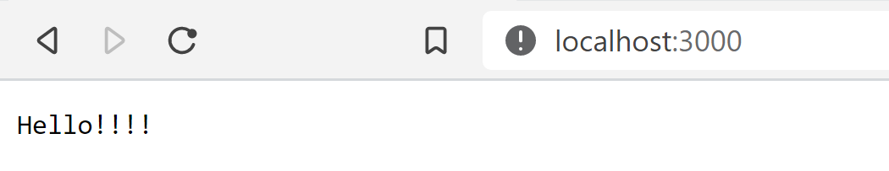

# DockerExampleNode

This is an example of nodejs deployed in docker.

## Requirements

You need the following tools:
* Docker (>=20.10.0)

## Installation

First download or clone the repository. Next place in the folder and open a terminal.

## Run Installation

In order to deploy the app first, you have to run the Dockerfile using the following command

```docker
docker build -t node_app .
```

### Explain of DockerFile
* The DockerFile use the container of nodejs version 15
* Pass the project to the home directory
* Sets the directory work in home
* Expose the port 3000
* Run the command app.js

## Check the image created

Run the following command to see the image created

```docker
docker images
```

## Run the container

Once the image is created we can run a container with the config defined, to run:

```docker
docker run -p 3000:3000 node_app
```

It shows the following output:

```bash
Server started - 3000
```

## Check in browser

Open your browser and type in the search bar "localhost:3000" then you see the response from the server


